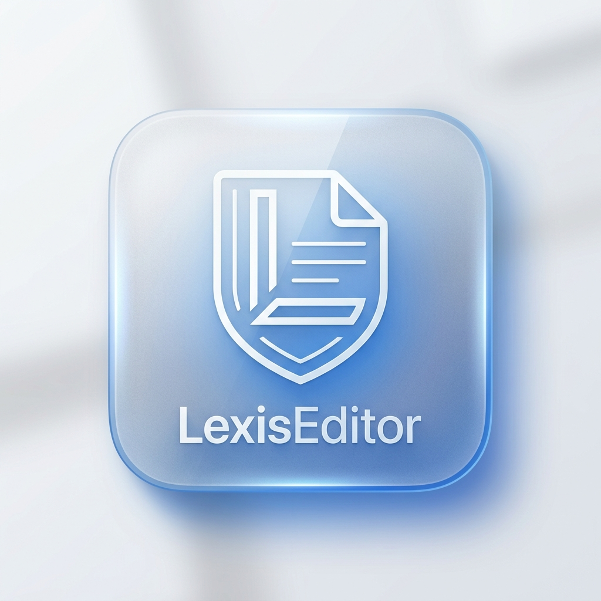

<div align="center">
  
  
  # LexisEditor
  **Profesionální AI-Native Legal Workspace**
  
  [](https://github.com/Zdenekdi/LexisEditor/releases)
  [](#)
  [](#)
  [](#)
</div>

---

## 🏛 O Projektu
**LexisEditor** je revoluční legal-tech platforma, která transformuje psaní dokumentů do digitální éry. Není to jen náhrada za MS Word – je to inteligentní asistent, který rozumí právnímu textu, hlídá lhůty a je přímo napojen na státní registry a doručovací kanály.

## ✨ Klíčové vlastnosti (Enterprise Ready)

### 🤖 1. LexisAI & Audit: Právní mozek v editoru
- **Hloubková kontrola (Audit)**: Linter v reálném čase detekuje terminologické chyby, logické rozpory a špatné citace zákonů s přímým odkazem na Zákony pro lidi.
- **AI Tabs**: Vyhrazený prostor pro Chat, Právní rešerši a Sumarizaci dokumentů.
- **LexisLink Remote**: Ovládáte AI Agenta mobilem přes QR kód – diktujete příkazy nebo žádáte o shrnutí na dálku.
- **Poznámka k AI**: LexisAI vyžaduje běžící jazykový model (lokální **Ollama** / **LexisLocal** nebo cloudové API). Bez připojeného modelu je k dispozici pouze offline režim s obecnými orientačními vzory, které **nejsou právní radou ani výstupem AI**.

### 🔌 2. Profesionální integrace a Registry
- **ARES Real-time**: Okamžité načítání subjektů podle IČO.
- **ISDS Bridge & ZFO Import**: Příjem a odesílání datových zpráv (.zfo) přímo z editoru. Automatická extrakce příloh a chytré parsování předmětu zpráv do názvu dokumentu.
- **Česká pošta (Dopis Online)**: Odesílání fyzických dopisů jedním kliknutím bez nutnosti chodit na pobočku.

### 🔐 3. Security & Absolute Privacy
- **Biometrické zabezpečení**: Rychlé a bezpečné odemykání citlivých agend pomocí Touch ID (macOS) / otisku prstu.
- **SafeStorage**: Veškeré přihlašovací údaje k ISDS, Poště a AI klíče jsou šifrovány na úrovni operačního systému (Keychain/DPAPI).
- **Offline First**: Vaše dokumenty nikdy neopouštějí váš počítač bez vašeho souhlasu.

### 🏗️ 4. Document Intelligence
- **Deadline Guard**: Inteligentní sledování lhůt (vyjádření, odvolání) s badge notifikacemi a napojením na šablony podání.
- **PDF & ZFO Import**: Inteligentní převod neformátovaných PDF a datových zpráv do editovatelného právního textu.
- **Knihovna doložek**: Správa a rychlé vkládání vašich osvědčených právních konstrukcí.

## 🛠 Instalace a Build

### Spuštění ve vývojovém režimu
```bash
git clone https://github.com/Zdenekdi/LexisEditor.git
cd LexisEditor
npm install
npm start
```

### Produkční balíček
```bash
npm run dist
```

---
<div align="center">
  Vyvinuto pro moderní advokátní praxi. <br/>
  © 2026 LexisEditor Team
</div>
