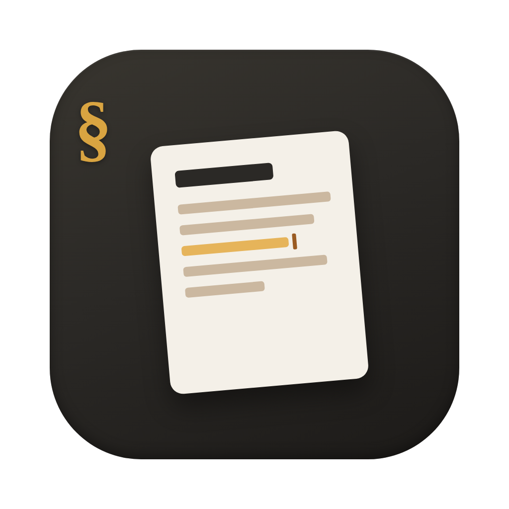

<div align="center">
  
  
  # LexisEditor v3.4.1
  **Profesionální AI-Native Legal Workspace**
  
  [](#)
  [](#)
  [](#)
</div>

---

## 🏛 O Projektu
**LexisEditor** je revoluční legal-tech platforma, která transformuje psaní dokumentů do digitální éry. Není to jen náhrada za MS Word – je to inteligentní asistent, který rozumí právnímu textu, hlídá lhůty a je přímo napojen na státní registry a doručovací kanály. Vše běží **lokálně** na počítači advokáta (datová suverenita).

## ✨ Klíčové vlastnosti v3.4.1 (Enterprise Ready)

### 🤖 1. LexisAI & Audit: Právní mozek v editoru
- **Hloubková kontrola (Audit)**: Linter v reálném čase detekuje terminologické chyby, logické rozpory a špatné citace zákonů s přímým odkazem na Zákony pro lidi.
- **AI nad výběrem i dokumentem**: Analyzovat, Přepsat, Vysvětlit, Přeložit, Hledat rizika, Shrnutí, Dopsat AI, generovat doložky a podání.
- **Lokální AI (offline)**: podpora **Ollama** i **Apple Intelligence (apfel)** na Apple Silicon — žádná data neopouštějí počítač.
- **LexisLink Remote**: Ovládáte AI agenta mobilem přes QR kód – diktujete příkazy, skenujete listiny (OCR) nebo žádáte o shrnutí na dálku.

### ⚖️ 2. Právní inteligence: citace, judikatura, kalkulačky
- **Legal Linker**: automatický převod zmínek paragrafů a zákonů na ověřené hypertextové odkazy.
- **Judikatura & Rejstřík citací**: vyhledání rozhodnutí a automatický přehled citovaných zdrojů (Table of Authorities).
- **Kalkulačky**: soudní poplatek, advokátní tarif (177/1996 Sb.), úrok z prodlení.
- **Deadline Guard / Lhůtník**: hlídání procesních lhůt se správným výpočtem (posun na pracovní den, svátky, § 57 o.s.ř.) a exportem do kalendáře (.ics / Google / Outlook).

### 🔌 3. Profesionální integrace a Registry
- **ARES Real-time**: okamžité načítání subjektů podle IČO; **ISIR** (insolvence).
- **ISDS Bridge & ZFO Import**: příjem a odesílání datových zpráv (.zfo) přímo z editoru, extrakce příloh, chytré parsování předmětu; podepsané doručenky a hlídání fikce doručení.
- **Česká pošta (Dopis Online)**: odeslání fyzického dopisu jedním kliknutím.
- **LexisConnect API**: LexisEditor naslouchá na portu **3300**; externí systémy (Evolio, SingleCase…) mohou poslat POST na `/api/import` a dokument se okamžitě načte.
- **Adresář & hlavičkový papír**: kontakty, doplnění firmy z ARES, profil advokáta automaticky do záhlaví, podpisový blok, digitální podpis PDF.

### 🔐 4. Security & Absolute Privacy
- **Biometrické zabezpečení**: odemykání pomocí Touch ID (macOS) / Windows Hello / otisku prstu.
- **SafeStorage**: přihlašovací údaje k ISDS, Poště a AI klíče šifrovány na úrovni OS (Keychain/DPAPI).
- **Záloha & obnova šifrovacího klíče**: klíč je uložen mimo data — záloha je nutná (bez ní nelze data po reinstalaci obnovit).
- **Anonymizace (GDPR Shield)** a **čištění metadat** před odesláním. **Offline First** — dokumenty neopouštějí počítač bez vašeho souhlasu.

### 🏗️ 5. Document Intelligence & produktivita
- **Editace**: Quill editor, styly, tabulky, obrázky, poznámky pod čarou, číslování, § symbol, automatický obsah, titulní strana, záhlaví/zápatí, vodoznak, tmavý režim.
- **Revize**: sledování změn, přijmout/odmítnout, porovnání verzí, **historie verzí**, komentáře, finální audit.
- **Šablony & doložky**: knihovna doložek, šablony (uložit/spravovat/tovární), plná moc, generátory.
- **Automatizace**: odpověď na 1 klik (adresát, spzn., č.j., Věc), **hromadné generování / kampaně**, **vykazování práce (timesheet)**.
- **Export & import**: DOCX, PDF, Bundle, webový náhled, e-mail; import PDF/DOCX/ZFO s převodem do editovatelného textu.

## 🛠 Instalace a Build

### Spuštění ve vývojovém režimu
```bash
git clone https://github.com/Zdenekdi/LexisEditor.git
cd LexisEditor
npm install
npm start
```

### Testy
```bash
npm test           # jednotkové testy (Jest)
npm run test:e2e   # e2e (Playwright)
npm run test:smoke # rychlý smoke test startu aplikace
```

### Produkční balíček
```bash
npm run dist
```

---
<div align="center">
  Vyvinuto pro moderní advokátní praxi. <br/>
  © 2026 LexisEditor Team
</div>
